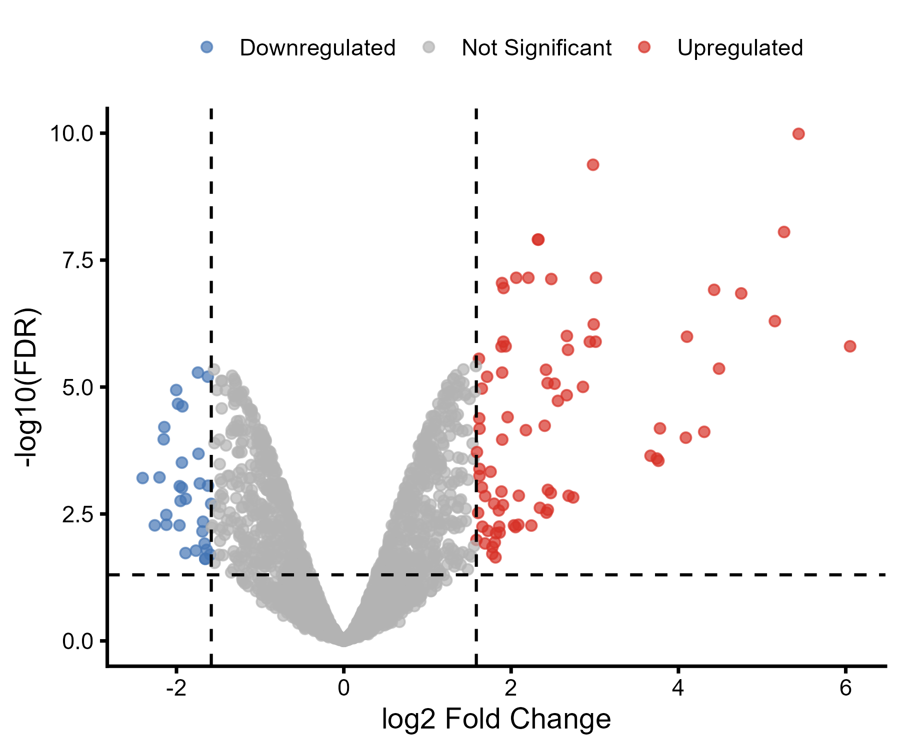
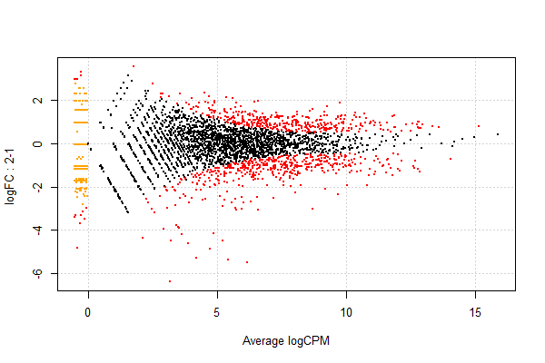

# RNA-seq Analysis of *E. coli* Under Mild Hydrostatic Pressure

## Overview

This project reproduces and re-analyzes the RNA-seq study:

**Guyet et al. (2018)**  
*Mild hydrostatic pressure triggers oxidative responses in Escherichia coli*  
PLOS ONE 13(7): e0200660  
https://doi.org/10.1371/journal.pone.0200660

The original study investigated transcriptomic changes in *Escherichia coli* K-12 MG1655 exposed to mild hydrostatic pressure (1 MPa).

This project was performed as a learning exercise to practice:

- RNA-seq preprocessing in Linux
- read alignment and quantification
- differential expression analysis using edgeR
- reproducibility of published transcriptomic studies

---

## Original Study Summary

The paper reported that exposure to 1 MPa pressure induced oxidative stress responses and altered iron metabolism in *E. coli*.

The authors identified:

- 101 differentially expressed genes (DEGs)
- 85 upregulated genes
- 16 downregulated genes

Many DEGs were associated with:

- oxidative stress response
- iron acquisition
- Fe-S cluster assembly
- oxygen-related metabolism

---

## Workflow

The RNA-seq analysis pipeline included:

1. Download RNA-seq data from SRA
2. Convert SRA files to FASTQ
3. Perform quality trimming using Trimmomatic
4. Align reads using STAR
5. Generate count matrix using mmquant
6. Perform differential expression analysis using edgeR in R

---

## RNA-seq Preprocessing Tools

| Step | Tool |
|------|------|
| SRA download | prefetch |
| FASTQ conversion | fasterq-dump |
| Quality trimming | Trimmomatic |
| Read alignment | STAR |
| Read quantification | mmquant |
| DEG analysis | edgeR |

---

## Input Data

RNA-seq samples used in this project:

- SRR7217923
- SRR7217925
- SRR7217927
- SRR7217929

Raw sequencing data were obtained from the NCBI SRA database.

---

## Differential Expression Analysis

Genes were considered differentially expressed if they satisfied:

- FDR < 0.05
- |log2FC| > 1.584

This corresponds approximately to a 3-fold expression change.

---

## Results Obtained in This Reproduction Analysis

After filtering low-expression genes using `filterByExpr()` in edgeR:

- Total DEGs: 112
- Upregulated genes: 81
- Downregulated genes: 31

These results were similar to the original publication.

## Biological Interpretation

The results suggest that mild hydrostatic pressure induces strong oxidative stress responses in *E. coli*.

Many upregulated genes were associated with:

- iron transport
- Fe-S cluster assembly
- oxidative stress defense
- oxygen metabolism

Genes such as:

- `cyoA`
- `iscS`
- `entF`
- `cirA`

showed strong differential expression, consistent with the original study.

---

## Project Structure

```text
RNAseq-pressure-response/
├── data/
├── figures/
├── results/
├── scripts/
└── workflow/
```

---

## Scripts

### `scripts/linux_pipeline.sh`

Linux preprocessing workflow including:

- FASTQ generation
- quality trimming
- STAR alignment
- mmquant counting

### `scripts/edgeR_analysis.R`

R script for:

- normalization
- DEG detection
- FDR correction
- MA plot generation

---

## Output Files

### `results/DEG_filtered.txt`

Filtered differentially expressed genes.

### `figures/MA_plot.png`

MA plot generated using edgeR.

---

## Purpose of This Project

This project was conducted to improve practical skills in:

- RNA-seq analysis
- Linux bioinformatics workflows
- transcriptome reproducibility analysis
- statistical analysis of gene expression data

---
## Figures

### Volcano Plot

Differentially expressed genes between low-pressure (LP) and high-pressure (HP) conditions.

- Red: upregulated genes
- Blue: downregulated genes
- Grey: non-significant genes



---

### MA Plot

MA plot generated from edgeR differential expression analysis.



---
## Reference

Guyet A, Dade-Robertson M, Wipat A, Casement J, Smith W, Mitrani H, Zhang M.  
**Mild hydrostatic pressure triggers oxidative responses in *Escherichia coli***.  
PLOS ONE. 2018;13(7):e0200660.  
https://doi.org/10.1371/journal.pone.0200660

---

## Author

Wasim Akram


